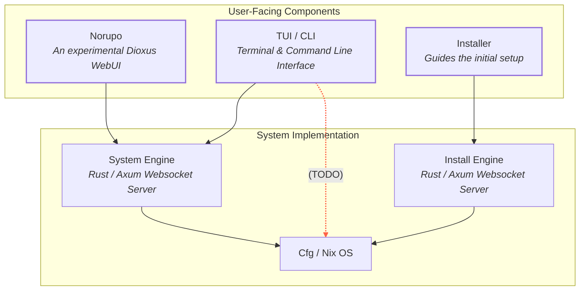
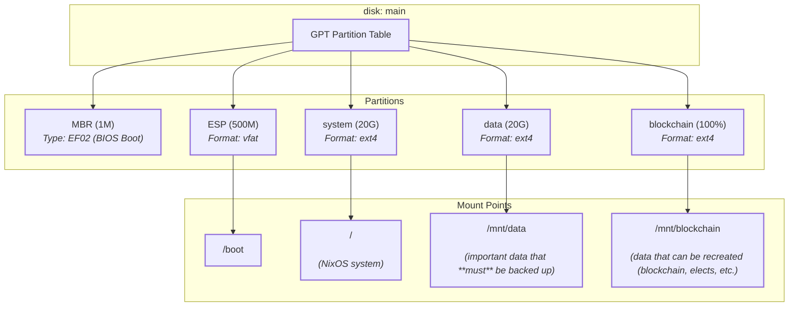

# System Overview

### Component Descriptions

**Norupo**
Norupo is the web-based user interface for NixBlitz, built using the Dioxus framework. It provides a graphical interface for managing the NixOS system. This component is currently **experimental and doesn't include any authentication**.

**TUI / CLI**
The TUI / CLI serves as the primary entry point for users to interact with NixBlitz. It offers an terminal user interface and a command-line interface, guiding users through the entire installation and management process of NixBlitz environments. It primarily leverages the `nixblitz_cli` Rust crate.

**Installer**
The Installer component is responsible for guiding the initial setup process of the NixBlitz environment. It works in conjunction with the `Install Engine` to provide a user-friendly experience for setting up the system. The user-facing part is handled by `nixblitz_cli`, while the backend logic is managed by `nixblitz_installer_engine`.

**System Engine**
The System Engine is a Rust-based web server, built with the Axum framework, that manages the NixOS system after the initial installation. It provides an API that allows frontend components (like Norupo and the TUI/CLI) to interact with and control the NixOS environment, facilitating system-level operations. It is implemented in the `nixblitz_system_engine` crate.

**Install Engine**
Similar to the System Engine, the Install Engine is also a Rust-based web server utilizing Axum. Its specific role is to handle the installation process, communicating with frontend components (TUI/CLI or Norupo) over WebSockets. This communication provides real-time updates and guidance during the system's installation. It is implemented in the `nixblitz_installer_engine` crate.

**Cfg / Nix OS**
This component represents the core NixOS configuration and the underlying operating system itself. It is the target for all system-level operations and configurations initiated by the Install Engine and System Engine. The `nixblitz_system` crate provides the low-level functionality for interacting with this part of the system, including managing Nix configurations and gathering system information.

### Disk Layout
Only one disk layout is supported at the moment:

